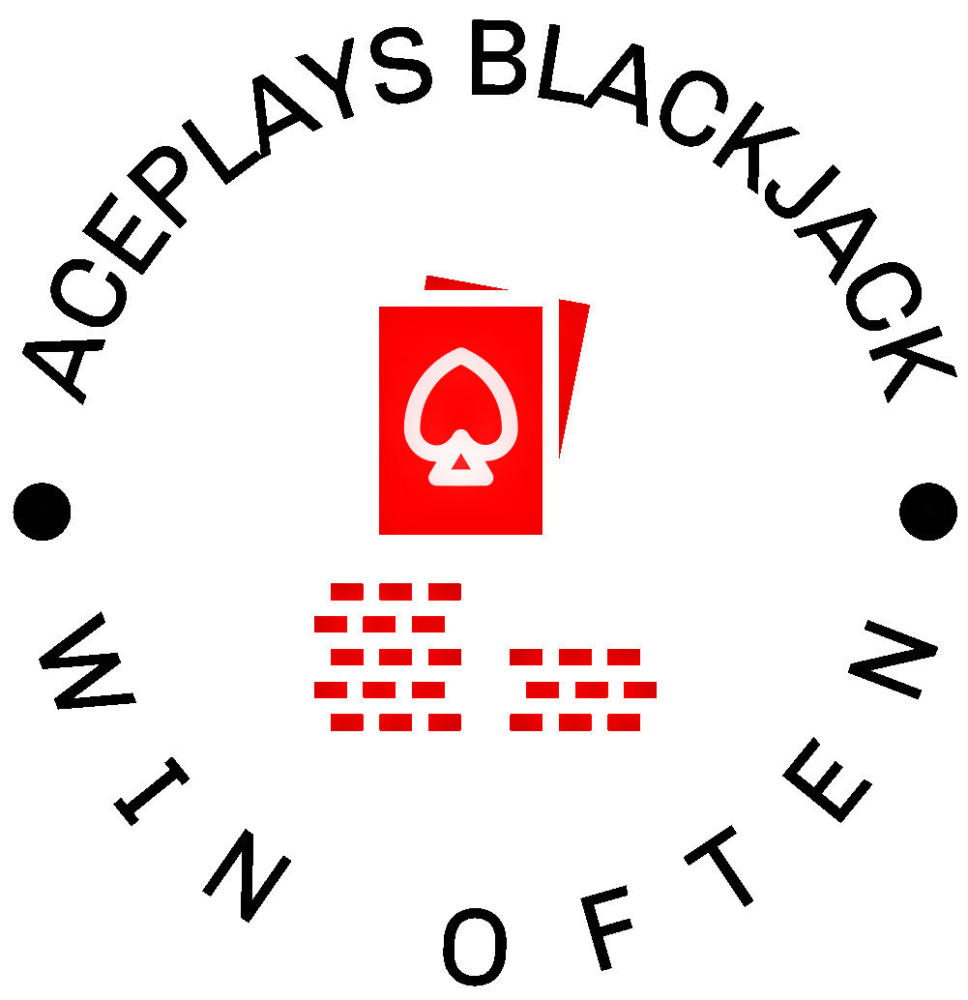

<a name="readme-top"></a>


<!-- PROJECT LOGO -->
<br />
<div align="center">
  <a href="https://github.com/Ace-Plays-Blackjack/ace-plays-game">
    
  </a>

<h2 align="center">AcePlays</h2>

  <p align="center">
    A device that can help you win at Blackjack by indicating the optimal play.
    <br />
  </p>

<h2 align="center">
  <a href="https://ace-plays-blackjack.github.io/ace-plays-game/">
  Documentation
  </a>
<br />
  <a href="https://github.com/Ace-Plays-Blackjack/ace-plays-game/wiki">
  Wiki
  </a>
  for more infromation
</h2>
<br />

</div>

<!-- LINKS -->

[![Contributors][contributors-shield]][contributors-url]
[![Forks][forks-shield]][forks-url]
[![Stars][stars-shield]][stars-url]
[![MIT License][license-shield]][license-url]

[![Twitter][twitter-shield]][twitter-url]
[![Youtube][youtube-shield]][youtube-url]

<!-- Demo of our Working Blackjack Decision Maker -->
# Demo of our Working Blackjack Decision Maker
<h2 align="center">

[](https://www.youtube.com/watch?v=ok-4RcKvypY)

</h2>
<!-- TABLE OF CONTENTS -->
<details>
  <summary>Table of Contents</summary>
  <ol>
    <li>
      <a href="#about-the-project">About The Project</a>
    </li>
    <li>
      <a href="#getting-started">Getting Started</a>
      <ul>
        <li><a href="#prerequisites">Prerequisites</a></li>
        <li><a href="#installation">Installation</a></li>
      </ul>
    </li>
    <li><a href="#usage">Usage</a></li>
    <li><a href="#roadmap">Roadmap</a></li>
    <li><a href="#contributing">Contributing</a></li>
    <li><a href="#license">License</a></li>
    <li><a href="#contact">Contact</a></li>
    <li><a href="#acknowledgments">Acknowledgments</a></li>
  </ol>
</details>

<!-- ABOUT THE PROJECT -->
# About The Project

The AcePlays device helps you learn about the game of Blackjack and win against your friends. By identifying the cards played in real-time, AcePlays can teach the player how to play the game with the optimal strategy, telling them whether to Hit, Stand, Double or Split.

<p align="right">(<a href="#readme-top">back to top</a>)</p>


<!-- GETTING STARTED -->
# Getting Started

## Prerequisites
* The AcePlays code has been developed using a **Raspberry Pi 3B**. However, any model *shoud* work.
* Installation of the **Raspbian Bullseye** Raspberry Pi OS.
* A working **Raspberry Pi Camera** (Module V2 has been used for development). Follow https://projects.raspberrypi.org/en/projects/getting-started-with-picamera/0 for first-usage instructions.

## Installation
1. Clone this repository on your Pi:
```
$ git clone https://github.com/Ace-Plays-Blackjack/ace-plays-game.git
```

2. Install `cmake` and `gcc` compiler:
```
$ sudo apt install cmake gcc
```

3. Install OpenCV. Easiest method is to use the following command, which will install all OpenCV libraries and dependencies:
```
$ sudo apt install libopencv-dev
```

4. Install the `libcamera` dependencies:
```
$ sudo apt install libcamera-dev
```

4. Install pigpio:
```
$ wget https://github.com/joan2937/pigpio/archive/master.zip
$ unzip master.zip
$ cd pigpio-master
$ make
$ sudo make install
```

5. Install Doxygen and Graphviz:
```
$ sudo apt-get install doxygen
$ sudo apt install graphviz
```

<!-- USAGE EXAMPLES -->
# Usage
The Raspbian Bullseye OS introduced a new camera stack driver called [libcamera](https://www.raspberrypi.com/documentation/computers/camera_software.html#getting-started) (follow the link for more information).

OpenCV can find an appropriate driver automatically, however the resolution defaults at the lowest available option. Moreover, OpenCV does not support libcamera at the moment.

The [LCCV](https://github.com/Qengineering/LCCV) repo by [QEngineering](https://github.com/Qengineering) has been used to provide support for the new camera stack. Follow the link for more detailed explanation.

Users have the freedom to select between the **OLD** or **NEW** stack. Unfortunately, when using the OLD stack the resolution cannot be changed.

## Using the NEW stack
1. **Disable** Legacy stack support in Pi configuration. Write the following command in the terminal:
```
$ sudo raspi-config
```
2. Navigate to `Interface Options` -> `Legacy Camera` -> `No`
3. Reboot to enable the changes
4. In `CMakeLists.txt` set the `NEW_CAM_STACK` option to `ON`:

```
option(NEW_CAM_STACK "Select new or old CAM stack: NEW==ON, OLD==OFF" ON)
```
5. Build the project

## Using the OLD stack
1. **Enable** Legacy stack support in Pi configuration. Write the following command in the terminal:
```
$ sudo raspi-config
```
2. Navigate to `Interface Options` -> `Legacy Camera` -> `Yes`
3. Reboot to enable the changes
4. In `CMakeLists.txt` set the `NEW_CAM_STACK` option to `OFF`:

```
option(NEW_CAM_STACK "Select new or old CAM stack: NEW==ON, OLD==OFF" OFF)
```
5. OpenCV needs to be pointed to the [V4L Linux Driver](https://www.kernel.org/doc/html/v4.8/media/v4l-drivers/index.html) to access the camera. Ensure that `cv::CAP_V4L2` is used in the `camera_obj` constructor in `camera.cpp`:

```
CamSettings.camApi = cv::CAP_V4L2;
```
5. Build the project

## Running the project
An `~/ace-plays-game/build` folder is used to place all built project files from CMake. 

Navigate to the cloned AcePlays directory and run the following:

```
$ mkdir build && cd build
$ cmake .. && make
$ sudo ./ACE_PLAYS
```

Command `$ sudo ./ACE_PLAYS` runs the created `ACE_PLAYS.exe`.
`pigpio` library requires running with `sudo` privileges.

## Creating the Documentation
Navigate to the ace-plays-game main folder and run the following:

```
$ doxygen
```

<!-- ROADMAP -->
# Roadmap
Future Work

<!-- CONTRIBUTING -->
# Contributing

<!-- LICENSE -->
# License
Distributed under the `MIT` License. See [`LICENSE`](https://github.com/Ace-Plays-Blackjack/ace-plays-game/blob/main/LICENCE) for more information.
Need to rework the license.
<p align="right">(<a href="#readme-top">back to top</a>)</p>


<!-- CONTACT -->
# Contact
* [Georgios Titas](https://github.com/titasg) --> giorgostitas@gmail.com
* [Alexander Douglas](https://github.com/Eagleeye101) --> lex4ander@gmail.com
* [Jijo Neeruvilayil Varghese](https://github.com/jijoNV) -->	jijon92@gmail.com

<!-- ACKNOWLEDGMENTS -->
# Acknowledgments
We would like to thank the following repositories:
* [EdjeElectronics](https://github.com/EdjeElectronics/OpenCV-Playing-Card-Detector): AcePlays builds on top of this Python-based card detection repo
* [QEngineering](https://github.com/Qengineering/LCCV): AcePlays uses the Libcamera C++ API wrapper for OpenCV (LCCV) to support the new Rasp Pi camera stack

<p align="right">(<a href="#readme-top">back to top</a>)</p>


<!-- MARKDOWN LINKS & IMAGES -->
<!-- https://www.markdownguide.org/basic-syntax/#reference-style-links -->
[contributors-shield]: https://img.shields.io/github/contributors/Ace-Plays-Blackjack/ace-plays-game.svg?style=for-the-badge
[contributors-url]: https://github.com/Ace-Plays-Blackjack/ace-plays-game/graphs/contributors
[forks-shield]: https://img.shields.io/github/forks/Ace-Plays-Blackjack/ace-plays-game.svg?style=for-the-badge
[forks-url]: https://github.com/Ace-Plays-Blackjack/ace-plays-game/network/members
[stars-shield]: https://img.shields.io/github/stars/Ace-Plays-Blackjack/ace-plays-game.svg?style=for-the-badge
[stars-url]: https://github.com/Ace-Plays-Blackjack/ace-plays-game/stargazers
[issues-shield]: https://img.shields.io/github/issues/Ace-Plays-Blackjack/ace-plays-game.svg?style=for-the-badge
[issues-url]: https://github.com/github_username/repo_name/issues
[license-shield]: https://img.shields.io/github/license/Ace-Plays-Blackjack/ace-plays-game.svg?style=for-the-badge
[license-url]: https://github.com/Ace-Plays-Blackjack/ace-plays-game/blob/master/LICENSE.txt

[twitter-shield]: https://img.shields.io/twitter/follow/username?label=Twitter&style=social
[twitter-url]: https://twitter.com/AcePlays_UoG

[youtube-shield]: https://img.shields.io/youtube/channel/views/UCsEz7-PU1gYQ-DuntVkb_oQ?style=social
[youtube-url]: https://www.youtube.com/channel/UCsEz7-PU1gYQ-DuntVkb_oQ
<!-- [youtube-url]: https://www.youtube.com/@aceplaysblackjackdecisionmaker -->
